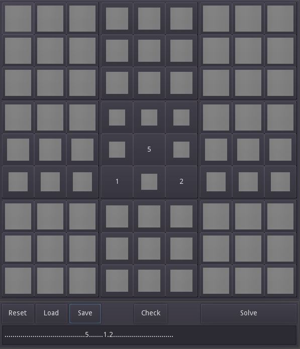

# WFC-Sudoku
Solves sudoku puzzles using a wave function collapse algorithm. Makes mistakes sometimes, so you might want to try multiple times.

Made using Godot 3.

# Screenshots

# Precompiled builds
[HTML5 Export Available Here](https://jonnelafin.github.io/WaveFunctionCollapse-Sudoku/) and [here](https://jonnelafin.itch.io/wfc-sudoku)

# Saving and Loading
This program can export and read string-type representations of the sudoku-board following the standard [this page](https://www.7sudoku.com/instructions/loading-puzzles) defines, making it compatible with all 7sudoku puzzles.
